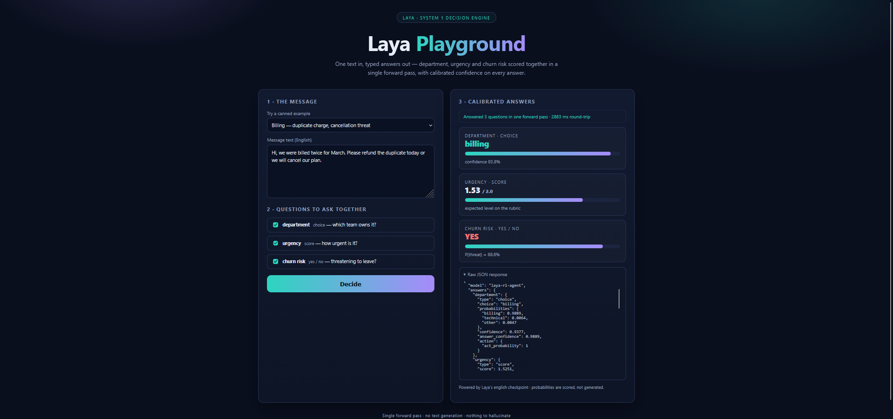

# Laya Playground

Minimal FastAPI wrapper around [Laya](https://huggingface.co/convaiinnovations/laya) `Router`.
One text in, typed answers out — no text generation, nothing to hallucinate.



Flow: `state + typed questions -> one forward pass -> calibrated answers`.

Question types: `choice` (department), `score` (urgency), `noul` (churn risk).

## Endpoints

- `GET /` — Playground UI (`static/index.html` + `static/app.js`)
- `GET /health` — `{"status": "ok"|"degraded", "loaded": bool}`
- `POST /decide` — `{ state, questions }` → `router.predict()` result

## Run

```bash
pip install -r requirements.txt
uvicorn app:app --reload
# or: python app.py
```

Open http://localhost:8000

The `Router(preload=True)` loads once at startup (`lifespan` in `app.py`)
and is reused for every request.

## Test it works

1. UI loads:

```bash
curl http://localhost:8000/
```

2. Static assets load:

```bash
curl -I http://localhost:8000/static/app.js
curl -I http://localhost:8000/static/style.css
```

3. Decide (one forward pass, 3 questions at once):

```bash
curl -X POST http://localhost:8000/decide ^
  -H "Content-Type: application/json" ^
  -d "{\"state\": {\"body\": \"Hi, we were billed twice for March. Please refund the duplicate today or we will cancel our plan.\"}, \"questions\": {\"department\": {\"type\": \"choice\", \"instructions\": \"Which department should handle this request?\", \"criteria\": {\"billing\": \"invoices, payments, refunds\", \"technical\": \"bugs, outages, system errors\", \"other\": \"everything else\"}}, \"urgency\": {\"type\": \"score\", \"instructions\": \"How urgent is this request?\", \"criteria\": [\"not urgent\", \"soon\", \"critical deadline or blocking issue\"]}, \"churn_risk\": {\"type\": \"noul\", \"instructions\": \"Does the user threaten to cancel or leave?\"}}}"
```

Expect `{"answers": {"department": ..., "urgency": ..., "churn_risk": ...}, "routing": ...}`.

4. Browser test: pick Billing / Outage / Feature preset, tick questions,
hit **Decide** — cards render with confidence bars + raw JSON below.

## Files

- `app.py` — API + lifespan preload + `to_jsonable()` numpy coercion
- `static/` — UI (no build step)
- `requirements.txt` — `fastapi`, `uvicorn[standard]`, `laya`
